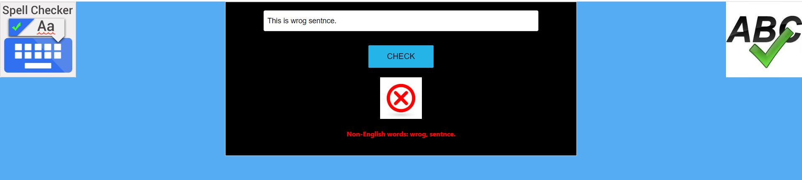
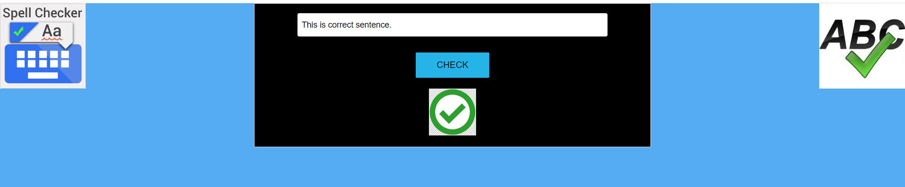

## Overview

Spell-checker is a simple application which has mainly 2 components:
- Frontend UI application written in `ReactJs`. Here is the [URL](https://spell-checker-ui.vercel.app/).
- Backend API written in `javascript`. Here is the [URl](https://spell-checker-backend.vercel.app/checkwords).

### Frontend

For this application to use, please enter any sentense and this application shows all words which are `NOT` English words.

### Backend API

If you prefer to test backend api, please follow below steps.

- Format of backend api is: https://spell-checker-backend.vercel.app/checkwords/<word1|word2|word3....word>
- The response of this API displays Non-English characters in JSON format.
- Below are few examples:
	- https://spell-checker-backend.vercel.app/checkwords/Xyz  => Xyz 
	- https://spell-checker-backend.vercel.app/checkwords/xyz => xyz
	- https://spell-checker-backend.vercel.app/checkwords/XYZ => XYZ
	- https://spell-checker-backend.vercel.app/checkwords/xYz => xYz
	- https://spell-checker-backend.vercel.app/checkwords/xYZ => xYZ
	- https://spell-checker-backend.vercel.app/checkwords/xyz|dog => xyz
	- https://spell-checker-backend.vercel.app/checkwords/xyz|DOG => xyz
	- https://spell-checker-backend.vercel.app/checkwords/xyz| |DOG => xyz
	- https://spell-checker-backend.vercel.app/checkwords/xyz|DOG|ABCD => xyz, ABCD

### Run locally
 
To run locally, In visual studio code, go to the sub folder (backend or frotnend) and run `npm run start` :
- Frontend: http://localhost:3000/
- Backend: http://127.0.0.1:8080/checkwords/xyz
